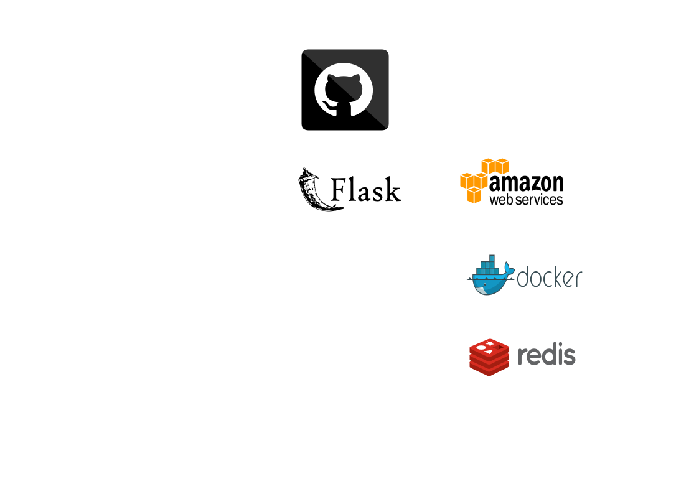

# flask toy

flask 직업 찾기 클론코딩, 이것저것 붙여보기

## architecture



## how to run

```bash
docker-compose up
```

## issue

- 

## todo


- CI툴 사용해보기
- github action으로 배포자동화
- db서버 따로 만들고 API로 통신(RPC 알아보기)
- swagger로 api관리, README.MD에 표시

## doing

- LRU캐시
- celery로 비동기 db 갱신

### done

- flask 직업 찾기 클론코딩
- poetry -> docker
- ec2 linux환경으로 실행가능하게 만들기
- redis로 캐싱

## issue

- 

### issuelog

- requirements pip 버전 안맞음 -> venv & pip freeze(계속 안맞으면 자동화 고려)

## maintenance

- 아키텍쳐 만들기(vecta.io -> svg -> md)
- 테스트 코드 작성