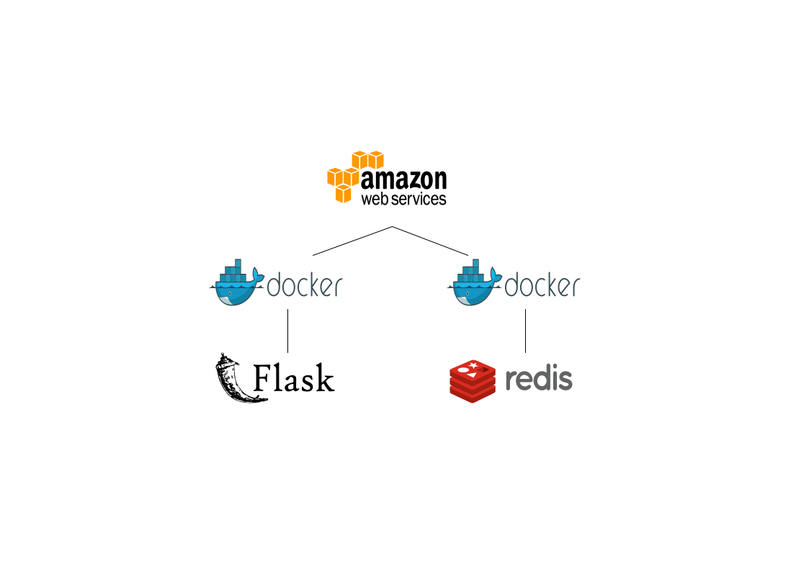

# flask toy

flask 직업 찾기 클론코딩, 이것저것 붙여보기

## architecture



## how to run

```bash
docker-compose up
pip istall poerty && poetry install
poetry run flask run
```

## issue

- 

## todo

- 리팩토링(flask 컨벤션으로 모듈화)
- CI툴 사용해보기
- github action으로 배포자동화
- celery로 비동기 db 갱신
- db서버 따로 만들고 API로 통신(RTC 알아보기)
- swagger로 api관리, README.MD에 표시

## doing

- 

## done

- flask 직업 찾기 클론코딩
- poetry 연동
- .flaskenv 연동
- ec2 linux환경으로 실행가능하게 만들기
- redis로 캐싱

## maintenance

- 아키텍쳐 만들기(vecta.io -> svg -> md)
- 테스트 코드 작성
